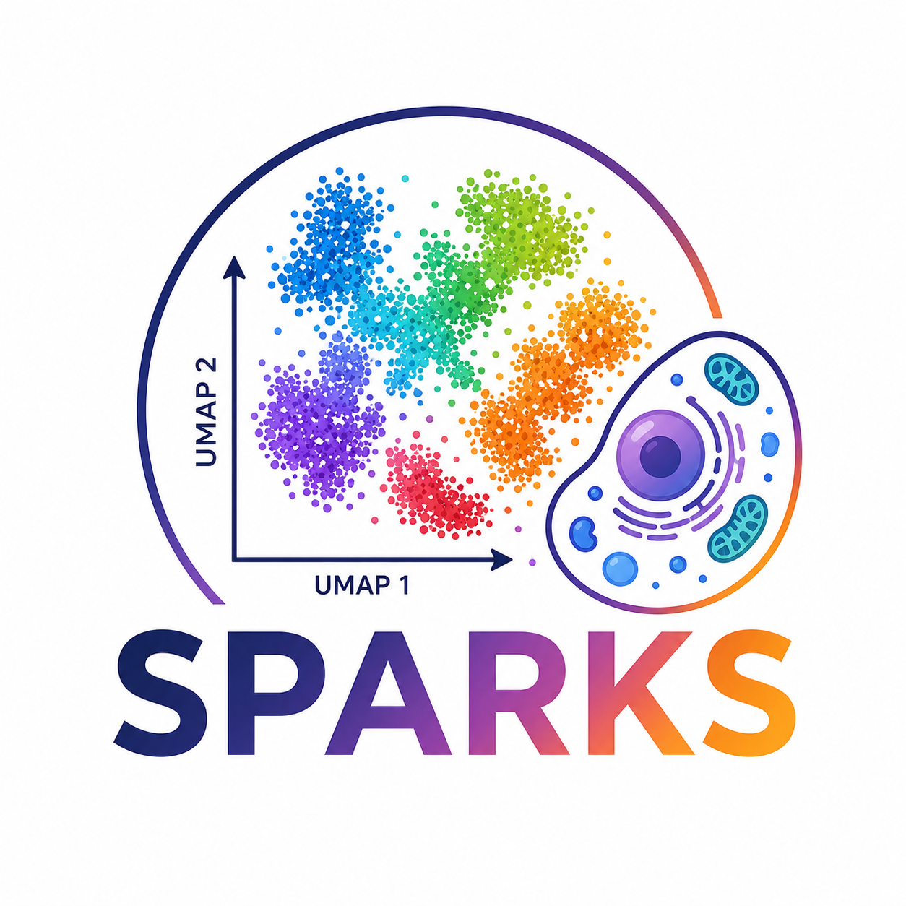

<p align="center">
  
</p>

<h1 align="center">SPARKS</h1>

<p align="center">
  Single-cell RNA-seq analysis toolkit
</p>

<p align="center">
  <a href="https://www.gnu.org/licenses/gpl-3.0">
    
  </a>
</p>

**SPARKS** (Single-cell Pipeline for Analysis of RNA-seq Systems) is a modular R package designed to streamline scRNA-seq analysis. It automates the workflow from raw count matrices (Alevin or Cell Ranger) to cluster identification, annotation, sex scoring, and differential expression analysis using **Seurat**, **SingleR**, and **scDblFinder**.

It provides an end-to-end framework for preprocessing, quality control, dimensionality reduction, clustering, visualization, and biological interpretation of single-cell transcriptomics datasets.

Species currently supported: **Human** and **Mouse**.

## Key Features

- **Automated Workflow**: Processes multiple samples and comparison groups in a single run.
- **Flexible Input**: Supports both 10X Genomics (Cell Ranger) and Alevin output formats.
- **Comprehensive QC**: Automated filtering based on mitochondrial content, feature counts, and doublet detection.
- **Cell Type Annotation**: Integrated SingleR support with customizable reference datasets.
- **Advanced Scoring**: Built-in modules for sex scoring and cell cycle regression.
- **Subset Analysis**: Targeted re-clustering and analysis for specific cell populations defined in the config.

## Installation

You can install the development version of SPARKS from GitHub:

```r
# Install devtools if not already installed
if (!require("devtools", quietly = TRUE)) install.packages("devtools")

# Install SPARKS
devtools::install_github("lavauxt/SPARKS")
```

## Quick Start

### 1. Prepare your Sample Table
Create a `sample_table.tsv` defining your data folders and experimental conditions:

| folder_id | protocol | comparison_group |
| :-------- | :------- | :--------------- |
| Sample_A  | WT       | Group_1          |
| Sample_B  | KO       | Group_1          |

### 2. Configure the Pipeline
Copy the provided mouse template and modify it for your study. You can override specific parameters (e.g., QC thresholds, resolution) in a separate YAML file.

### 3. Run the Pipeline

```{r run-sparks, eval=FALSE}
library(SPARKS)

# Run the complete analysis
# For mouse
run_pipeline(
  base_config_path     = "./inst/config_template_mouse.yaml",
  override_config_path = "./inst/examples/config.yaml"
)

# For human
run_pipeline(
  base_config_path     = "./inst/config_template_human.yaml",
  override_config_path = "./inst/examples/config.yaml"
)
```

## Configuration

The pipeline is entirely driven by a YAML configuration. Key sections include:

* **pipeline**: Input/Output paths and species selection.
* **qc**: Thresholds for filtering (e.g., `max_mt_percent`, `min_features`, and `max_doublet_rate`).
* **species**: Gene patterns for removal (Rps/Rpl, mitochondrial genes, or sex-linked genes) and `SingleR` reference selection.
* **subsets**: Define specific clusters or cell types to trigger automated sub-clustering and targeted analysis.

## Output Structure

The pipeline generates an organized results directory:

* **QC/**: Quality control plots (Violin plots for features/counts and mitochondrial percentage).
* **UMAP/**: Dimension reduction plots split by condition and labeled by clusters or cell types.
* **DEG/**: Tables of Differentially Expressed Genes and corresponding visualizations (Heatmaps/Volcano plots).
* **RData/**: Saved Seurat objects (`.Rdata`) for downstream interactive analysis and reproducibility.